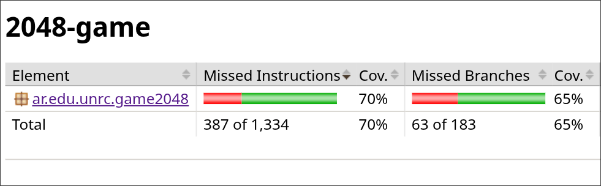
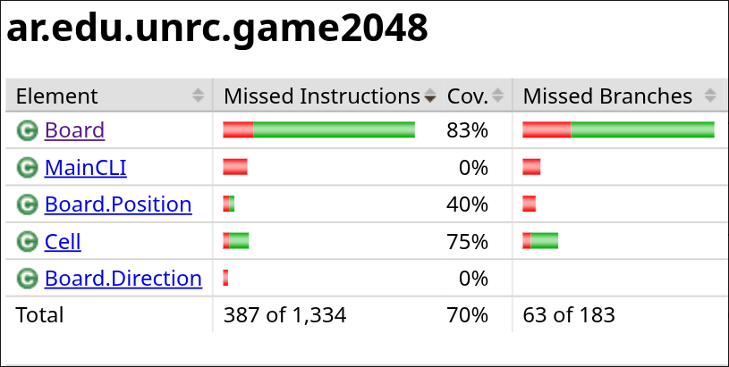
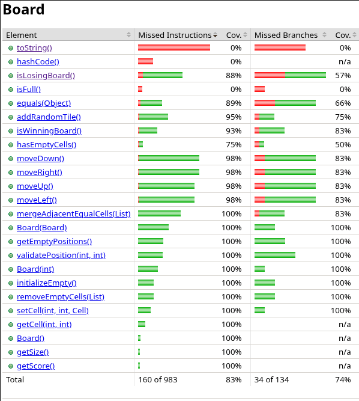
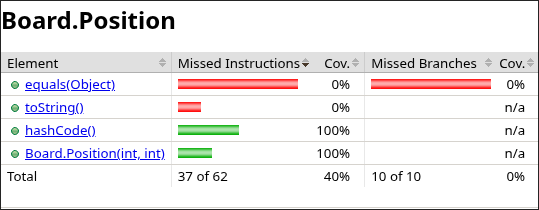
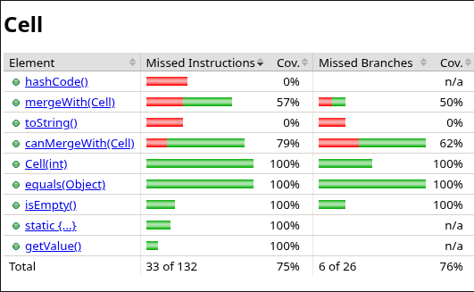
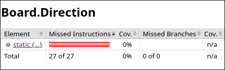
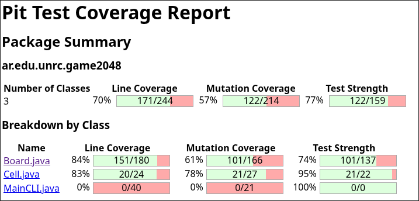

## Test report

Este archivo contiene las metricas del proyecto antes
de haber aplicado más técnicas de testing.

#### Covertura del package

En un primer intento de correr JaCoCo la covertura sobre el package del proyecto fue la siguiente

#### Covertura de las clases

Dentro de lo que fue la covertura del package podemos ver como se cubrieron las siguientes clases.

### Covertura de métodos por clases

#### Clase Board

#### Clase Board.position

#### Clase Cell

#### Clase Board.Direction

## Covertura corriendo PITest

Al correr la siguiente herramienta nos encontramos con las siguientes métricas
en cuanto a los mutantes que fueron eliminados y aquellos que sobrevivieron.

### Nuevas metricas

A continuación se proveen las metricas luego de haber aplicado las
técnicas más apropiadas para testear cada parte del proyecto.

....
