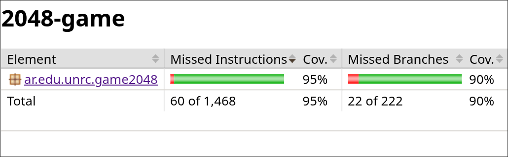
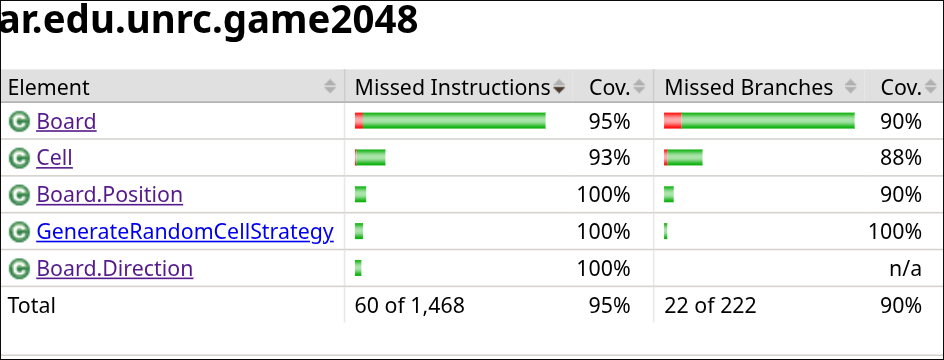
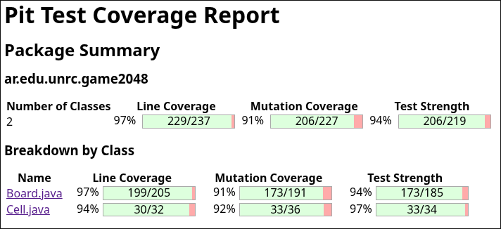

# Test report

Este archivo contiene las métricas del proyecto antes de haber aplicado más técnicas de testing.

## Cobertura del package (Fase 1)

En un primer intento de correr JaCoCo la cobertura sobre el package del proyecto fue la siguiente:

## Cobertura de las clases (Fase 1)

Dentro de lo que fue la cobertura del package podemos ver cómo se cubrieron las siguientes clases:

### Cobertura de métodos por clase

#### Clase Board

#### Clase Board.Position

#### Clase Cell

#### Clase Board.Direction

## Cobertura corriendo PITest (Fase 1)

Al correr la siguiente herramienta nos encontramos con las siguientes métricas en cuanto a los mutantes que fueron eliminados y aquellos que sobrevivieron.

---

## Nuevas métricas (Fase 3: Randoop + repOK)

A continuación se proveen las métricas luego de haber aplicado técnicas más apropiadas para testear cada parte del proyecto.

### Cobertura con JaCoCo

Luego de haber mejorado la test suite gracias a correr la herramienta
randoop logramos mejorar tanto la cobertura de los test como el
strength de los mismos.

> `MainCLI` fue excluido del análisis de cobertura por tratarse de la interfaz de línea de comandos, sin tests.

### Análisis de mutación PITest

Además del análisis de cobertura también volvimos a correr PITest
y el resultado nos muestra como mejoró la cobertura de mutation test.

