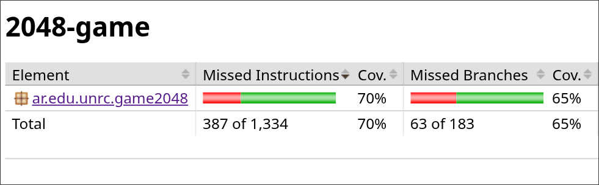
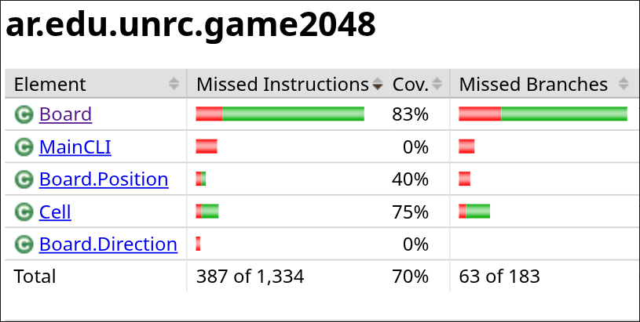
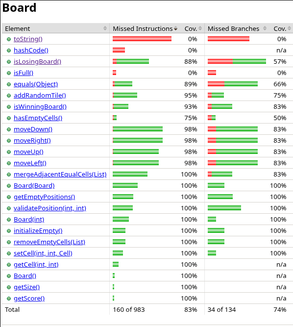
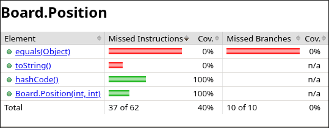
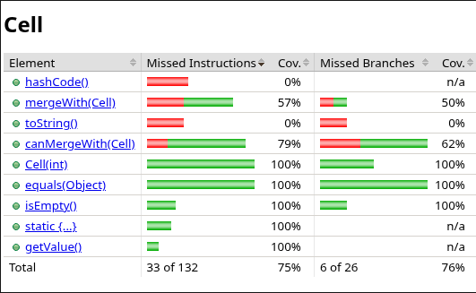
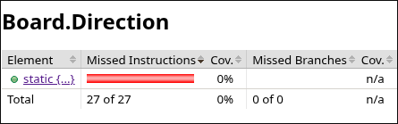
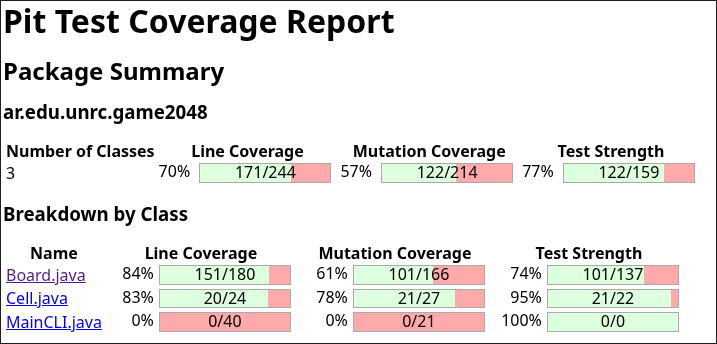
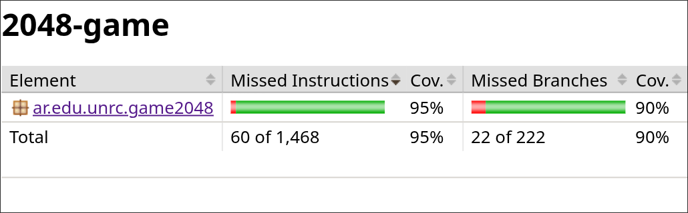
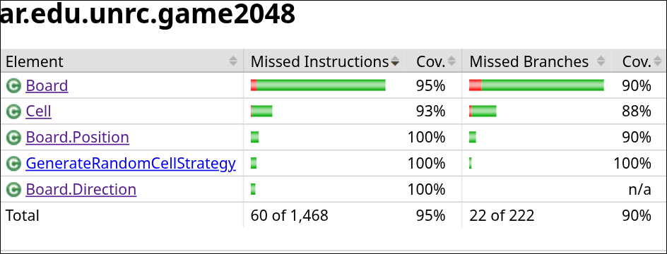
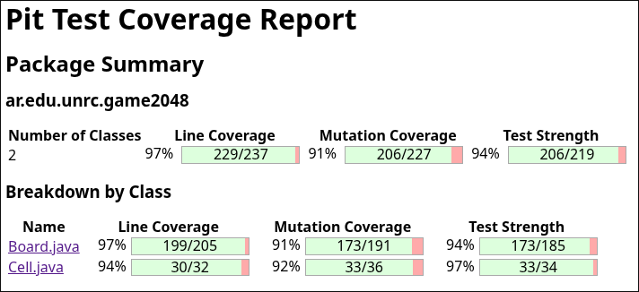

# Test report

Este archivo contiene las métricas del proyecto antes de haber aplicado más técnicas de testing.

## Cobertura del package (Fase 1)

En un primer intento de correr JaCoCo la cobertura sobre el package del proyecto fue la siguiente:



## Cobertura de las clases (Fase 1)

Dentro de lo que fue la cobertura del package podemos ver cómo se cubrieron las siguientes clases:



### Cobertura de métodos por clase

#### Clase Board



#### Clase Board.Position



#### Clase Cell



#### Clase Board.Direction



## Cobertura corriendo PITest (Fase 1)

Al correr la siguiente herramienta nos encontramos con las siguientes métricas en cuanto a los mutantes que fueron eliminados y aquellos que sobrevivieron.



---

## Nuevas métricas (Fase 3: Randoop + repOK)

A continuación se proveen las métricas luego de haber aplicado técnicas más apropiadas para testear cada parte del proyecto.

### Cobertura con JaCoCo

Luego de haber mejorado la test suite gracias a correr la herramienta
randoop logramos mejorar tanto la cobertura de los test como el
strength de los mismos.




> `MainCLI` fue excluido del análisis de cobertura por tratarse de la interfaz de línea de comandos, sin tests.

### Análisis de mutación PITest

Además del análisis de cobertura también volvimos a correr PITest
y el resultado nos muestra como mejoró la cobertura de mutation test.



El comando utilizado con randoop para generar los test restantes fue:

```bash
java -cp "lib/randoop-all-4.3.4.jar:target/classes" randoop.main.Main gentests \
--testclass=ar.edu.unrc.game2048.Board \
--testclass=ar.edu.unrc.game2048.GenerateDeterministicCellStrategy \
--testclass=ar.edu.unrc.game2048.GenerateRandomCellStrategy \
--omit-methods-file=omit-methods.txt \
--time-limit=60 \
--junit-output-dir=src/test/java \
--junit-package-name=randoopTests.board
```

Comando para correr `evosuiteparam.sh`:

````bash
chmod +x evosuiteparam.sh
./evosuiteparam.sh Cell                           # normal
FIX_CLASSLOADER=1 ./evosuiteparam.sh Cell         # si la cobertura sale en 0
SEARCH_BUDGET=30 ./evosuiteparam.sh Cell          # prueba rápida
EVOSUITE_JAR=/ruta/al/jar ./evosuiteparam.sh Cell # otro jar```
```
````

---
# Referido a Assigment 3

## Análisis de los tests generados (Fase 1)

### ¿Qué inputs generó EvoSuite?

EvoSuite generó tests que ejercitan los métodos públicos de `Cell` y `Board`:

**Cell:** constructores con potencias de 2 (2, 4, 8, 16), `0` y `Cell.EMPTY`. Métodos: `getValue()`, `isEmpty()`, `canMergeWith()`, `mergeWith()`, `equals()`, `hashCode()`, `toString()`, `repOK()`.

**Board:** constructores con tamaños variados (2, 4, 37, 64) y con estrategia determinista. Métodos: `moveUp()`, `moveDown()`, `moveLeft()`, `moveRight()`, `getScore()`, `isFull()`, `isLosingBoard()`, `isWinningBoard()`, `getEmptyPositions()`, `repOK()`. También probó casos inválidos (tamaños 0, -1, 122, 327 → excepciones).

### ¿Los test oracles son significativos?

**Parcialmente.** Hay dos tipos:

- **Significativos:** `assertEquals(0, board0.getScore())`, `assertFalse(board0.isWinningBoard())`, `assertEquals(4, board0.getSize())`. Verifican comportamiento real.
- **Débiles (regresión):** `assertEquals(string3, string0)` o `assertNotNull(board0)`. Solo reproducen lo observado, sin verificar correctitud.

### ¿Hay tests frágiles?

**Sí:**

- **Dependen de `Random`:** tests como `new Board()` o `new Board(4)` crean tableros con fichas aleatorias. Los asserts sobre el estado final (ej. `assertEquals(8, board0.getScore())`) fallan según la semilla.
- **Asserts sobre `toString`:** comparan strings completos del tablero, sensibles al estado aleatorio inicial.
- **Tamaños irreales:** tests con `Board(37)` no aportan al juego real (siempre es 4x4).


## Comparación de cobertura y mutación

> **Nota sobre métricas:** La *cobertura de ramas* (branch coverage) mide qué ramas de condicionales se ejecutaron. La *cobertura de líneas* (line coverage) mide qué líneas de código se ejecutaron. La cobertura de ramas es más estricta y suele dar un número menor.

### Cobertura de ramas (JaCoCo)

| Suite    | Board | Cell | Total |
|----------|-------|------|-------|
| Manual   | 85%   | 72%  | 84%   |
| EvoSuite | 78%   | 88%  | 80%   |
| Randoop  | 83%   | 75%  | 75%   |

**Observaciones:**
- EvoSuite es mejor en `Cell` (88%).
- Los tests manuales ganan en `Board` (85%).
- Randoop tiene la cobertura total más baja (75%).

### Mutación (PITest)

| Suite    | Line Coverage | Mutation Score | Test Strength |
|----------|---------------|----------------|---------------|
| Manual   | 93%           | 86%            | 92%           |
| EvoSuite | N/A           | N/A            | N/A           |
| Randoop  | 88%           | 77%            | 89%           |

### Nota sobre EvoSuite y PITest

No fue posible correr PITest sobre EvoSuite. Los tests usan `@RunWith(EvoRunner.class)`, un runner que controla el `ClassLoader` y mockea `Random`, lo cual es incompatible con el motor de mutación de PITest (falla con `RUN_ERROR`).

**Alternativa descartada:** regenerar con `-Dno_runtime_dependency=true` elimina el `EvoRunner`, pero los tests fallan masivamente en `Board` (asserts sobre posiciones aleatorias). El mutation score cayó del 66% al 15%.

Para EvoSuite, se reporta solo cobertura (JaCoCo). La comparación de mutación se hace entre Manual y Randoop.


## Resumen comparativo final

| Métrica              | Manual | EvoSuite | Randoop |
|----------------------|--------|----------|---------|
| Cantidad de tests    | 112    | 68       | 878     |
| Branch coverage      | 84%    | 80%      | 75%     |
| Line coverage        | 93%    | —        | 88%     |
| Mutation score       | 86%    | —        | 77%     |
| Test strength        | 92%    | —        | 89%     |

**Conclusión:** Los tests manuales siguen siendo la suite más efectiva. EvoSuite aporta mejor cobertura en `Cell`, pero no supera a los manuales en `Board` por el problema del `Random`. Randoop cubre menos código y genera más tests flaky.

## Fuzzing (Fase 2)

El metodo `fuzz()` se programo para correr 1000 trials. El resultado arrojado fue:

```bash
Summary:
  PASS        : 1000/1000
  FAIL        : 0/1000
  UNRESOLVED  : 0/1000

```

Estos resultados indican que la lógica interna de las clases e invariantes del `Board` soportan el ingreso masivo y aleatorio de comandos sin corromper el estado del juego.

Mientras que Evosuite y Randoop resultaron utiles para generar alta cobertura de codigo, el fuzzer combinado con el invariante `repOk()` resulto más efectivo para validar la estabilidad general del sistema. 
